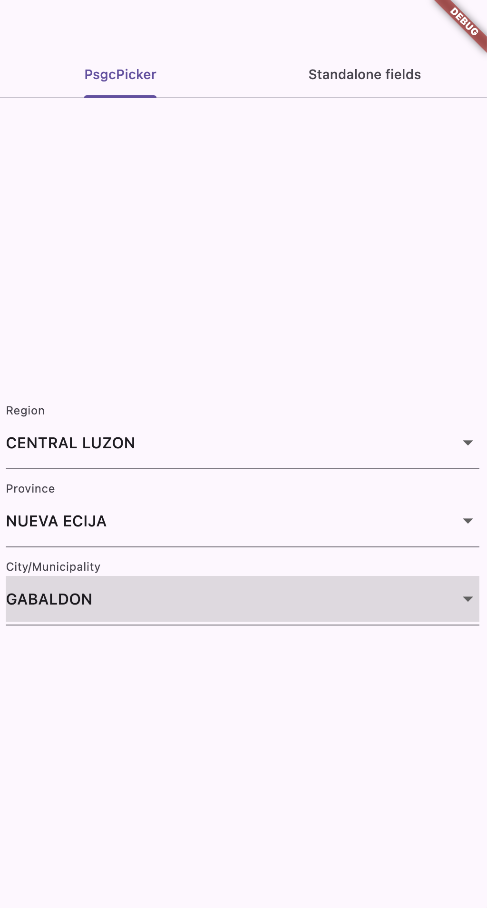
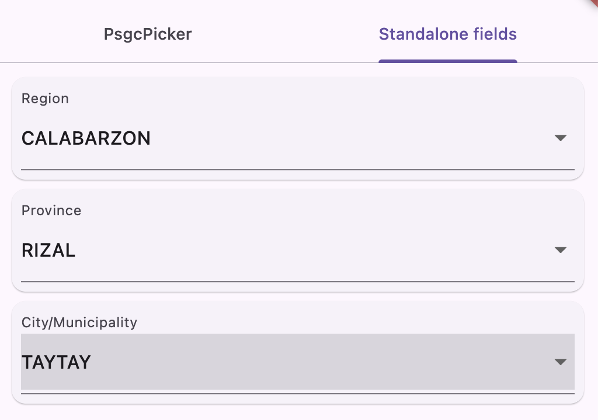

## PSGC Picker

This package is used for listing all the region, province, and city/municipality. Philippine Standard Geographic Codes

## Installation

In the `dependencies:` section of your `pubspec.yaml`, add the following line:
```yaml
dependencies:
  psgc_picker: <latest_version>
```
### Usage
```dart
import 'package:psgc_picker/psgc_picker.dart';

class MyApp extends StatelessWidget {
  const MyApp({super.key});

  // This widget is the root of your application.
  @override
  Widget build(BuildContext context) {
    return MaterialApp(
        title: 'Flutter Package Testing',
        theme: ThemeData(
          primarySwatch: Colors.blue,
        ),
        home: Scaffold(
          appBar: AppBar(),
          body: Center(
            child: PsgcPicker(
              regionLabel: 'Region',
              provinceLabel: 'Province',
              cityLabel: 'City/Municipality',
              selectedRegion: 'CALABARZON',
              selectedProvince: 'RIZAL',
              selectedCity: 'CAINTA',
              spacing: 5,
              onRegionChanged: (value) => {print(value)},
              onProvinceChanged: (value) => {print(value)},
              onCityChanged: (value) => {print(value)},
            ),
          ),
        ));
  }
}
```



### Advanced: standalone fields

`PsgcPicker` renders all three dropdowns together in one fixed column. If you need to place region/province/city elsewhere in your UI — separate cards, separate form sections, conditionally shown/hidden — create a `PsgcPickerController` once and use `PsgcRegionField`, `PsgcProvinceField`, and `PsgcCityField` independently. They share cascading state through the controller, wherever each one is placed in the tree.

```dart
class MyForm extends StatefulWidget {
  const MyForm({super.key});

  @override
  State<MyForm> createState() => _MyFormState();
}

class _MyFormState extends State<MyForm> {
  late final PsgcPickerController _controller;

  @override
  void initState() {
    super.initState();
    _controller = PsgcPickerController(
      selectedRegion: 'CALABARZON',
      selectedProvince: 'RIZAL',
      selectedCity: 'CAINTA',
      onRegionChanged: (value) => {},
      onProvinceChanged: (value) => {},
      onCityChanged: (value) => {},
    );
  }

  @override
  void dispose() {
    _controller.dispose(); // you own the controller, so you dispose it
    super.dispose();
  }

  @override
  Widget build(BuildContext context) {
    return Column(
      children: [
        Card(child: PsgcRegionField(controller: _controller, label: 'Region')),
        Card(child: PsgcProvinceField(controller: _controller, label: 'Province')),
        Card(child: PsgcCityField(controller: _controller, label: 'City/Municipality')),
      ],
    );
  }
}
```



### Styling

Each field (`regionLabel`/`regionDecoration`, `provinceLabel`/`provinceDecoration`, `cityLabel`/`cityDecoration` on `PsgcPicker`; `label`/`decoration` on `PsgcRegionField`, `PsgcProvinceField`, `PsgcCityField`) accepts either:

- a plain `String` label — wrapped internally as `InputDecoration(labelText: label)`, or
- a full `InputDecoration` — for control over borders, fill color, icons, hint text, error text, etc. When both are supplied, `decoration` takes precedence over `label`.

`spacing` on `PsgcPicker` controls the vertical gap between the three dropdowns.

```dart
PsgcPicker(
  regionDecoration: const InputDecoration(
    labelText: 'Region',
    prefixIcon: Icon(Icons.map_outlined),
    border: OutlineInputBorder(),
    filled: true,
  ),
  provinceDecoration: const InputDecoration(
    labelText: 'Province',
    border: OutlineInputBorder(),
  ),
  cityDecoration: const InputDecoration(
    labelText: 'City/Municipality',
    border: OutlineInputBorder(),
  ),
  spacing: 12,
  selectedRegion: 'CALABARZON',
  selectedProvince: 'RIZAL',
  selectedCity: 'CAINTA',
  onRegionChanged: (value) => {},
  onProvinceChanged: (value) => {},
  onCityChanged: (value) => {},
)
```

The same `decoration` parameter works identically on the standalone `PsgcRegionField`/`PsgcProvinceField`/`PsgcCityField` widgets.

## Notes

If the data is outdate, feel free to create issue. Thank you

## Credits

Data generated by this package are from https://psa.gov.ph/classification/psgc/